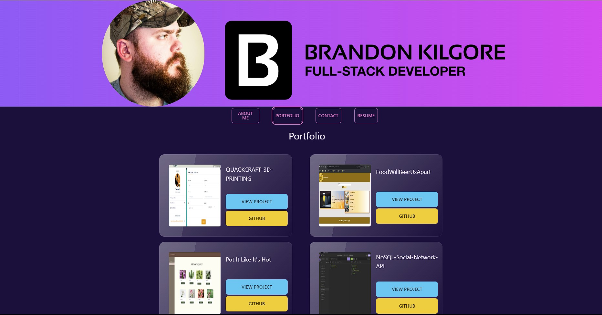
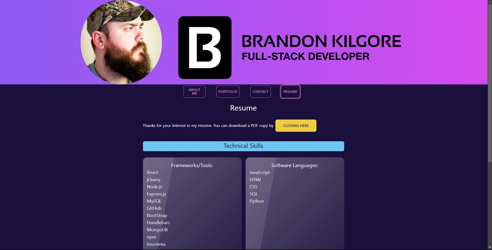

# React-Professional-Portfolio
## Description

This application is a React portfolio application to allow users to easily view my projects.  This application made using React, Tailwind, and DaisyUI.  The reason behind making this application is to allow users a quicker, easier way to view projects, and to also practice React front-end and UI development.

## Table of Contents

- [Installation](#installation)
- [Usage](#usage)
- [Credits](#credits)
- [License](#license)

## Installation

No installation is needed to view this portfolio application page.  User only needs to click the deployment link below to be taken to the portfolio page.

## Deployment Link

https://whispering-taiga-32488-3bcd433c5113.herokuapp.com/

## Usage

To use this application the user only needs to click on the deployment link above.  They will then be taken to the deployed portfolio application page.

From there the user can navigate to different sections to view different parts of site. From the different sections they are provided with information about me, projects, and access to download a pdf of me resume.

## Credits
Heroku Documentation:
https://devcenter.heroku.com/categories/reference

React Documentation:
https://legacy.reactjs.org/docs/getting-started.html

Tailwind Documentation:
https://v2.tailwindcss.com/docs

Daisyui Documentation:
https://daisyui.com/

## License

MIT License